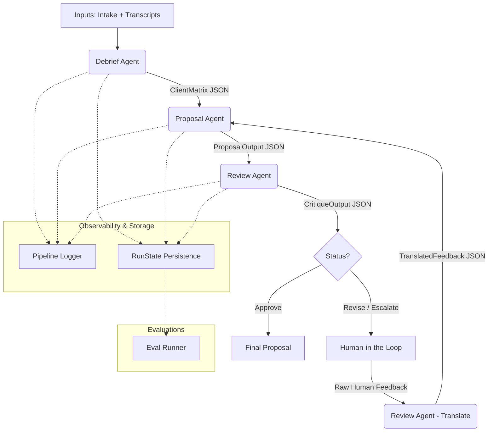

# Client Proposal Pipeline

A production-style multi-agent system designed to automatically synthesize sales intake forms and client meeting transcripts into structured, high-quality professional service proposals.

---

## 1. Architecture Diagram



### Pipeline Flow
1. **Debrief:** The system parses untrused user inputs (intake forms, raw meeting transcripts) and extracts a structured `ClientMatrix`.
2. **Proposal Generation:** The `ClientMatrix` is passed to the Proposal Agent, which drafts a v1 proposal using external pricing benchmarks.
3. **Review & Critique:** The Review Agent acts as an internal critic, grading the proposal against the matrix and identifying specific issues.
4. **Human-in-the-Loop (HITL):** If the proposal does not meet the approval threshold or triggers escalation, execution pauses. A human provides natural language feedback.
5. **Feedback Translation:** The Review Agent translates raw human feedback into structured, actionable instructions.
6. **Iteration:** The Proposal Agent uses the instructions to draft v2.

---

## 2. Framework Choice + Justification

This project utilizes a **custom lightweight orchestration architecture** utilizing Python, the native Anthropic SDK, and Pydantic. Heavyweight agent frameworks (like LangChain, LangGraph, or CrewAI) were intentionally avoided.

**Justification for a custom, lightweight approach:**
*   **Transparency & Controllability:** We maintain absolute control over the prompt context window and API payloads. Heavy frameworks often obfuscate prompts or silently inject intermediate steps, which ruins observability.
*   **Typed Contracts (Pydantic):** Data boundaries between agents are strictly enforced via Pydantic models. We know exactly what JSON structure is moving from the Debrief Agent to the Proposal Agent, making unit testing and schema validation trivial.
*   **Debugging Simplicity:** If the pipeline fails, the stack trace points directly to our code, not deep inside a third-party framework's state graph. Abstraction overhead is kept as close to zero as possible.

---

## 3. Why Three Agents Instead of Two or Four

The system is cleanly divided into Debrief, Proposal, and Review responsibilities. 

**"Could the Debrief and Proposal agents have been a single well-prompted Claude call?"**
Yes, but doing so creates a monolithic point of failure. Extracting matrix data (identifying contradictions, tracking confidence) requires deep analytical reasoning over dense, noisy text. Writing a proposal requires creative synthesis and formatting. 

Separating them provides critical architectural benefits:
*   **Failure Isolation:** If the matrix extraction fails, we can catch it before spending tokens on drafting a proposal.
*   **Contradiction Preservation:** By forcing the Debrief Agent to output a structured matrix with `confidence` and `contradiction_notes`, we prevent the AI from silently "smoothing over" stakeholder disagreements (e.g., the CTO and VP arguing over budget).
*   **Feedback Iteration Quality:** During the HITL loop, we only re-run the Proposal Agent. The matrix remains static. Re-reading a 10k-word transcript on every revision iteration would be a massive waste of API tokens and latency.
*   **Observability:** We can directly evaluate the `matrix.json` artifact to measure extraction recall independently of proposal writing quality.

**Why not more agents?**
Adding dedicated agents (e.g., a "Formatting Agent" or a "Pricing Agent") introduces unnecessary orchestration complexity, latency, and context-switching overhead without sufficient ROI for the scope of this assignment. 

---

## 4. State Design

State management is handled entirely by the `RunState` object, which acts as the single source of truth for a pipeline execution.

*   **Data Flow:** Agents communicate strictly via Pydantic schemas (e.g., `ClientMatrix` $\rightarrow$ `ProposalOutput` $\rightarrow$ `CritiqueOutput`). Raw text is never passed directly between agents.
*   **Persistence:** After every agent invocation, the `RunState` is serialized to disk (`runs/<run_id>/`). This includes `matrix.json`, `proposal.md`, `review.json`, `metadata.json`, and the `logs.json`.
*   **Iteration Tracking:** The state object tracks the current loop integer, preventing runaway loops.

**Why Full Feedback History?**
The implementation persists the *full* history of human feedback and prior critiques, rather than just passing the latest feedback string to the next prompt. 
*   *Tradeoff:* It consumes slightly more context window tokens.
*   *Benefit:* It prevents the Proposal Agent from "forgetting" instructions from iteration 1 while fixing issues in iteration 3. It also allows our automated evaluations to test for regression loops.

---

## 5. Termination Logic

The pipeline loop terminates under three specific conditions:
1.  **Approval:** The Review Agent grants an explicit `APPROVE` recommendation.
2.  **Max Iterations:** The system hits the hardcoded iteration limit (default: 5) to prevent infinite loops.
3.  **Divergence Detection:** The system forcefully stops early if it detects it is stuck in a failing loop.

**Divergence Detection Implementation:**
*"The system stops early if the same high-severity issue appears across 3 consecutive review cycles."*

**Why this heuristic?**
It is simple, deterministic, and highly observable. If the Proposal Agent repeatedly fails to resolve an issue flagged by the Review Agent (e.g., failing to include an exact pricing benchmark), we know the prompt logic or context window is fundamentally struggling. Rather than silently burning tokens in an infinite refinement loop, we halt execution and flag the run for engineer review.

---

## 6. Failure Modes Handled

### Schema Validation Failure
Because we force Claude to output strictly typed JSON, syntax errors (like missing commas or incorrect data types) are inevitable.
*   Every agent boundary utilizes strict Pydantic validation.
*   If validation fails, the `ClaudeClient` intercepts the `ValidationError` and automatically re-prompts a smaller, cheaper model (Haiku) with the exact error trace to fix the JSON formatting, ensuring the pipeline doesn't crash on simple syntax mistakes.

### API Failure / Rate Limit
*   The system implements an exponential backoff retry mechanism (1s $\rightarrow$ 2s $\rightarrow$ 4s) for `RateLimitError` and `APIStatusError`.
*   If retries are exhausted, the failure is logged gracefully, the current state is saved to disk, and a `PipelineError` is raised.

### Prompt Injection Awareness
*   Transcripts are explicitly treated as untrusted user input. 
*   Through API separation, hardcoded system prompts are isolated from transcript data, ensuring Claude evaluates transcripts as data to be analyzed, not instructions to be executed.

---

## 7. What I Would Do With Another 4 Hours

*   **Prompt Caching:** Implement Anthropic's prompt caching for the `ClientMatrix` and `intake.md` context blocks. Re-sending the same matrix during iterations 1, 2, and 3 is currently wasting input tokens.
*   **Parallel Review Critics:** Split the Review Agent into two parallel calls (e.g., one strictly grading Financials/Pricing, one grading Technicals) and merge their critiques to reduce the context burden on a single review pass.
*   **Streaming Proposal Generation:** Implement streaming for the `ProposalAgent` to improve perceived UI latency for the end user during the drafting phase.
*   **Branchable Checkpoints:** Allow the human user to revert back to "Iteration 2" if they realize their feedback in "Iteration 3" ruined the proposal structure.

*(Note: Enterprise buzzwords like "fine-tuning custom foundational models" or "deploying Kubernetes mesh networks" are intentionally omitted as they are unrealistic for this assignment's current maturity.)*

---

## 8. What Would Change For Production Deployment

Moving this to a real production environment requires shifting from a local CLI tool to a distributed architecture:

*   **State & Storage:** Shift from local JSON files to a persistent database (e.g., PostgreSQL for state metadata, S3/GCS for raw transcript and proposal artifacts).
*   **Async Job Queue:** Long-running pipeline executions must be offloaded to an asynchronous queue (e.g., Celery or Temporal) to prevent HTTP timeouts.
*   **Auth + RBAC:** Implement proper authentication. Dispatchers should only be able to view proposals they own; Admins can override the Human-in-the-Loop review phase.
*   **Secure Secrets Management:** Move the `ANTHROPIC_API_KEY` out of local `.env` files and into AWS Secrets Manager or HashiCorp Vault.
*   **Centralized Tracing:** Replace the local `logs.json` with an OpenTelemetry-compatible tracing system (e.g., LangSmith, Datadog, or Honeycomb) to visualize token usage and latency across distributed workers.
*   **Human Approval UI:** Replace the CLI `input()` prompt with a React-based frontend where reviewers can highlight specific text to generate targeted feedback.

---

## Setup & Usage

### 1. Environment Setup
Requires Python 3.10+.
```bash
python3 -m venv .venv
source .venv/bin/activate
pip install -r requirements.txt
```

### 2. Secrets
```bash
cp .env.template .env
```
Edit `.env` and insert your `ANTHROPIC_API_KEY`. The system is configured to use universally available models (`claude-3-5-sonnet-20240620` and `claude-3-haiku-20240307`) by default.

### 3. Running the Pipeline
To run the full pipeline sequentially across all transcripts in the `data/` directory:
```bash
# Interactive mode (requires human feedback)
python main.py

# CI/CD mode (auto-approves proposals without pausing)
python main.py --non-interactive
```
All outputs are saved to the `runs/<transcript_name>/` directory.

### 4. Running Evaluations
The system includes a centralized eval runner that grades historical pipeline runs for contradiction recall and feedback loop regression.
```bash
python main.py --eval
```
Eval reports are automatically saved as timestamped Markdown files in `eval_logs/`.

### Repository Structure
```
├── data/                  # Mock databases and static knowledge base
├── evals/                 # Automated evaluation scripts
├── inputs/                # Intake forms and transcripts
├── runs/                  # Generated state, proposals, and logs
├── src/
│   ├── agents/            # Agent logic (Debrief, Proposal, Review)
│   ├── core/              # Orchestration, state, and Claude API client
│   ├── schemas/           # Pydantic data boundaries
│   └── tools/             # Tool definitions (CRM, Benchmarking)
├── main.py                # Pipeline entrypoint
└── requirements.txt
```
